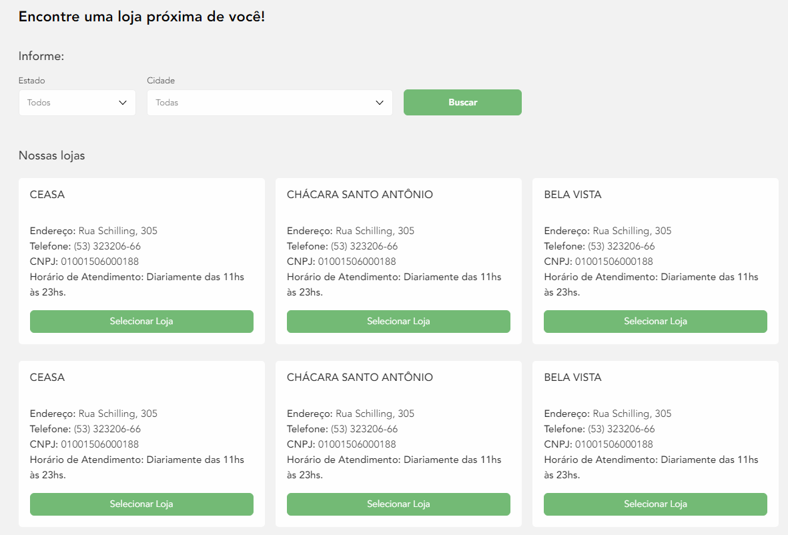

# Trilha Commerce Java

## Desafio Nivelamento: Página de Ecommerce "Nossas Lojas"

### Atividades

1) Implementar uma aplicação Java que exponha uma API REST (utilizando JSON). Essa API serve para armazenar as informações de lojas físicas de um e-commerce e deve permitir trabalhar com as informações como, mas não restrita, as disponíveis no arquivo de exemplo `lojas.md`. A aplicação deve possuir:
- os métodos HTTP:
    - método `POST` para cadastrar uma loja
    - método `PUT` para editar uma loja através do ID 
    - método `DELETE` para deletar uma loja através do ID
    - método `GET` para pegar as informações de uma loja através do ID
    - método `GET` para listar todas as lojas ou filtrar (por estado/cidade)
        - deve ser possível listar todas as lojas cadastradas, todas de um estado e todas de um conjunto estado/cidade
- conexão com banco de dados
- conjunto de cidades e estados consumidos das APIs do IBGE:
    - https://servicodados.ibge.gov.br/api/v1/localidades/municipios
    - https://servicodados.ibge.gov.br/api/v1/localidades/estados

2) Elaborar uma página em HTML e CSS que consuma a API utilizando JavaScript. O layout deve ser inspirado no do exemplo ao fim do arquivo e a página deve conter, pelo menos: 
- filtro com um campo de seleção do estado
- filtro com um campo de seleção de cidade, conforme o estado 
- filtro com um campo de busca de cidade pelo nome
- resultado da filtragem ou a listagem de todas as lojas

### Tecnologias e Ferramentas:
- Git
- Java
- Framework Spark
- Banco de Dados (Oracle, SQLite ou MySQL)
- HTML, CSS e JavaScript

### Avisos 
- Esse desafio tem duração máxima prevista de 24 horas 
- Deve ser disponibilizado em um repositório público (Github, Bitbucket, etc...), seguindo boas práticas de versionamento 
- No repositório devem conter instruções de execução do sistema em um README

### Exemplos de página que consuma a API:
- Exemplo de Front-end da API consumida no StoreFront
    

