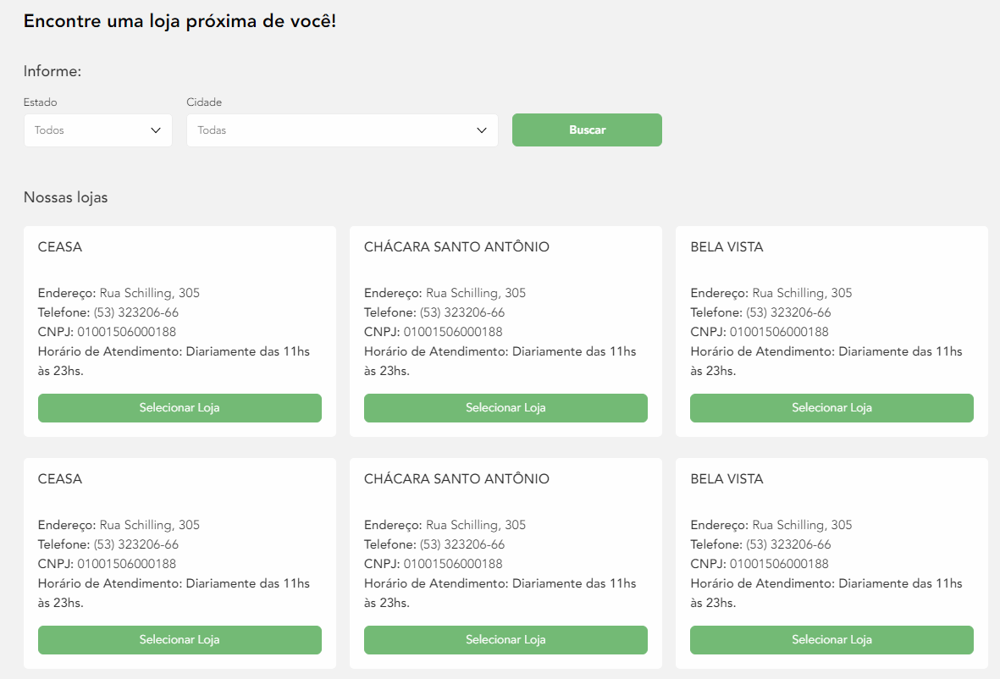

# Trilha Microservices Node.js

## Desafio I: API para Ecommerce "Nossas Lojas"

### Implementação
Implementar uma API REST (utilizando JSON) que permita consumir/trabalhar com as informações como, mas não restrita, as disponíveis em `lojas.md`. A API serve para armazenar as informações de lojas físicas de um e-commerce e deve conter: 
- os endpoints com um:
    - método `POST` para cadastrar uma loja
    - método `PUT` para editar uma loja através do ID 
    - método `DELETE` para deletar uma loja através do ID
    - método `GET` para pegar as informações de uma loja através do ID
    - método `GET` para listar todas as lojas ou filtrar (por estado/cidade)
        - deve ser possível listar todas as lojas cadastradas, todas de um estado e todas de um conjunto estado/cidade
- persistência em um banco de dados SQL ou noSQL 
- container com o ambiente completo (node)
- documentação utilizando Swagger
- bonus: container para a base de dados
- bonus: publicação no Heroku

- implementação com uso das ferramentas e tecnologias:
    - Git
	- Docker
    - Node.js
    - Banco de Dados (Oracle, MySQL, MariaDB ou MongoDB)
    - Swagger

### Exemplos de aplicação da API:

- Exemplo de Front-end da API consumida no Oracle Commerce Cloud StoreFront
    - 

### Avisos 
- Deve ser implementado apenas o back-end
- Devem ser utilizadas as técnicas vistas nos treinamentos da Alura
- Esse desafio tem duração prevista de 8 horas 
- Deve ser disponibilizado em um repositório público (Github, Bitbucket, etc...), seguindo práticas de versionamento aprendidas no curso
- No repositório devem conter instruções de execução do sistema em um README